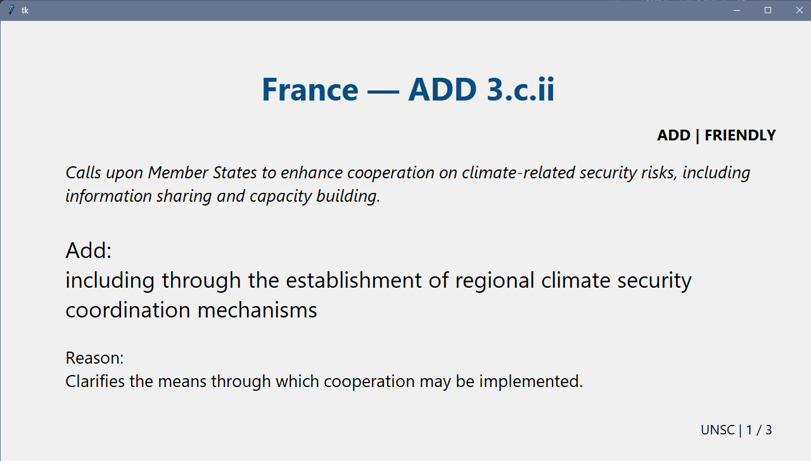

# Amendment-Displayer

Display Model UN Amendments using Python, instead of manually inputting into a PowerPoint

## Features:

- Display (Delegate, Location, Action, Reason, Friendly)
- Save, Import, Export

## Todo:

- Email Ingestion as source